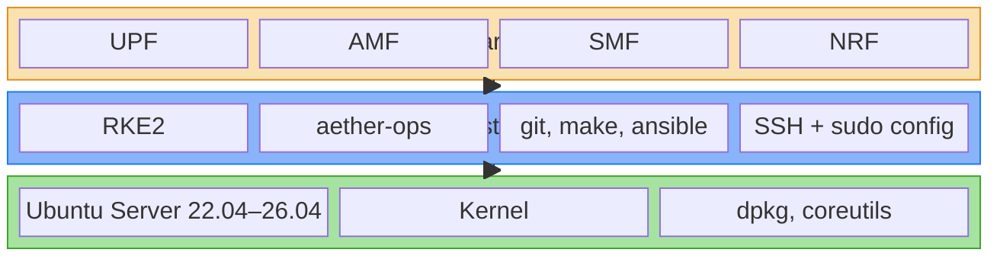
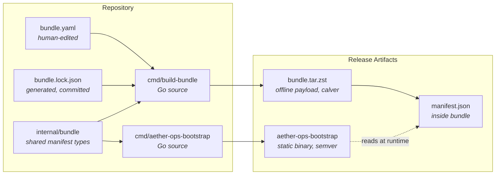
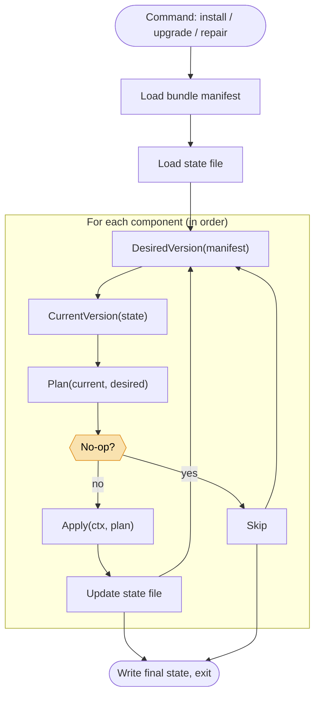
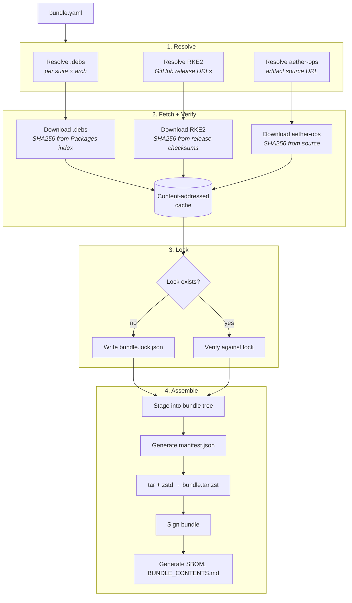

# aether-ops-bootstrap — Design

## Purpose

`aether-ops-bootstrap` takes a freshly installed Ubuntu Server host and produces a running aether-ops management plane on top of RKE2. It runs once per management node, requires no internet access, and hands off to aether-ops for all further configuration.

After bootstrap completes, aether-ops itself handles node expansion, user accounts, SSH distribution, cellular network function deployment, and day-2 operations. The bootstrap never runs again except for upgrades or repair.

## System model: three layers

The full system is described as a stack of three layers. This vocabulary is used consistently across docs, logs, and code.

- **OS layer** — Ubuntu Server, versions 22.04 through 26.04. Kernel, base packages, networking stack. Today the user installs this manually; a future ISO will deliver it. The bootstrap assumes nothing about this layer beyond a supported Ubuntu version.
- **Platform layer** — RKE2 plus aether-ops, together with the OS-level prerequisites needed to run aether-ops (git, make, ansible) and the SSH/sudo configuration aether-ops needs to operate. This is what `aether-ops-bootstrap` installs.
- **Cellular layer** — the 4G/5G network functions (UPF, AMF, SMF, and so on) that the platform layer deploys and manages. aether-ops owns this layer entirely; the bootstrap has no involvement.

Relationship verbs: the OS layer *hosts* the platform layer; the platform layer *manages* the cellular layer; the cellular layer *contains* network functions.

## System Overview

### Three-Layer Architecture



The bootstrap owns the **platform layer** only. The OS layer is pre-installed by the operator. The cellular layer is managed by aether-ops after handoff.

### Artifact Relationship



## Scope of the bootstrap

The bootstrap's responsibility begins at "a human just finished the Ubuntu installer and logged in once" and ends at "aether-ops is running, healthy, and reachable, with RKE2 underneath it." Specifically:

1. **Preflight validation.** Confirm Ubuntu version is in the 22.04–26.04 window, running as root, systemd present, supported architecture, sufficient disk and RAM, no prior bootstrap state conflicts with the requested action.
2. **OS-level prerequisites.** Install vendored `.deb` files for `git`, `make`, `ansible`, and their transitive dependencies. No apt, no network, no PPAs.
3. **SSH and sudo configuration.** Ensure sshd is running, drop configuration snippets into `/etc/ssh/sshd_config.d/` and `/etc/sudoers.d/`, create the aether-ops service account, generate or place its service keypair.
4. **RKE2 install.** Tarball method: verify checksums, extract to `/usr/local` (or `/opt/rke2` if `/usr/local` is read-only), stage airgap images under `/var/lib/rancher/rke2/agent/images/`, write `/etc/rancher/rke2/config.yaml`, install systemd units, enable and start `rke2-server`, wait for the Kubernetes API to report ready.
5. **aether-ops install.** Drop the daemon binary, write its systemd unit and initial config, enable and start it, wait for its health endpoint to come up.
6. **Handoff.** Print the URL and initial credential, write a completion record to the state file, exit cleanly.

Everything past step 6 is aether-ops' job.

## Non-assumptions

The bootstrap's strongest design rule is what it *refuses* to assume about the host.

- **No internet access, ever.** Not for a single `apt-get update`. Anything needed is in the bundle.
- **No installed packages beyond the Ubuntu `Essential: yes` and `Priority: required` set.** This excludes git, make, ansible, curl, wget, python3, and everything from universe. It includes `dpkg`, `useradd`, `groupadd`, and the coreutils — which are always present on any Ubuntu system and are treated as part of the OS itself.
- **No pre-existing users, SSH keys, `/etc/rancher` contents, firewall rules, or PPAs.**
- **No assumption about the network renderer** (NetworkManager vs systemd-networkd vs netplan-with-anything).
- **No assumption that apt mirrors are reachable.**

This strict stance drives most of the architectural decisions below.

## Artifacts

Two files, released independently but tested together.

### `aether-ops-bootstrap` — the launcher

A statically linked Go binary, `CGO_ENABLED=0`, 10–30 MB. Contains all logic: preflight, extraction, .deb handling, systemd unit writing, RKE2 install, aether-ops install, state management, reconciliation. Auditable on its own — `--help`, `--version`, and `--check` all work without a bundle present. Versioned with semver (e.g. `0.4.2`).

### `aether-ops-bundle-<version>-linux-<arch>.tar.zst` — the payload

An opaque tarball. Contains everything the launcher needs to *deliver*, structured as:

```
manifest.json
debs/
  ansible_*.deb
  git_*.deb
  make_*.deb
  ... (transitive deps)
rke2/
  rke2.linux-<arch>.tar.gz
  rke2-images-<variant>.linux-<arch>.tar.zst
  sha256sum-<arch>.txt
aether-ops/
  aether-ops
  aether-ops.service
  config.yaml.tmpl
templates/
  sshd_config.d/
  sudoers.d/
  rke2-config.yaml.tmpl
```

Versioned with calver (e.g. `2026.04.1`). The `manifest.json` is the contract between launcher and bundle: it lists every component's version, source, and hash, plus a `schema_version` the launcher checks before using the bundle.

## Launcher design

### Commands

- **`install`** — full bootstrap from scratch. Refuses to run if a prior successful install exists; override with `--force`.
- **`upgrade`** — compare the bundle's manifest to the state file and apply only the deltas.
- **`repair`** — re-run all reconciliation steps regardless of state, fixing drift.
- **`check`** — preflight and plan only, no changes. Dry-run.
- **`state`** — print the current state file.
- **`version`** — print launcher version, and bundle version if a bundle is present.

### Component Lifecycle

Every launcher command (`install`, `upgrade`, `repair`) follows the same loop. The `check` command runs the same loop but stops after Plan (dry-run).



### The Component interface

The install/upgrade/repair logic is a single loop over ordered components. Each component implements:

```go
type Component interface {
    Name() string
    DesiredVersion(b *bundle.Manifest) string
    CurrentVersion(s *state.State) string
    Plan(current, desired string) (Plan, error)
    Apply(ctx context.Context, plan Plan) error
}
```

Top-level commands walk the components in dependency order, call `Plan` to compute what would change, and call `Apply` unless in dry-run mode. Idempotency falls out naturally: if `current == desired` and configs match, `Plan` returns a no-op.

Initial component set, in order: `debs`, `ssh`, `sudoers`, `service_account`, `rke2`, `aether_ops`.

### Onramp deployment user

aether-ops uses Ansible over SSH to manage nodes. This requires an OS user on the management node (and target nodes) with:

- SSH password authentication enabled
- A known password for initial Ansible connections
- Passwordless sudo (`NOPASSWD: ALL`) for running privileged commands remotely

The bootstrap configures this via the `aether_ops.onramp_user` and `aether_ops.onramp_password` spec fields (defaulting to `aether`/`aether`). The `aether_ops` component creates the user, sets the password, drops a sudoers file at `/etc/sudoers.d/{user}`, and the `ssh` component drops `/etc/ssh/sshd_config.d/01-aether-password-auth.conf` to enable password authentication.

The onramp user (`aether`) is distinct from the service account (`aether-ops`). The service account runs the aether-ops daemon; the onramp user is the identity Ansible uses to SSH into nodes.

The default password should be changed immediately after initial setup. A future enhancement will allow overriding the password at install time via the `AETHER_ONRAMP_PASSWORD` environment variable.

SSH password authentication is scoped to only the onramp user via a `Match User` block in the sshd drop-in, rather than enabled globally. Other users must use SSH key-based authentication.

### State file

Lives at `/var/lib/aether-ops-bootstrap/state.json`. Records launcher version, bundle version, bundle hash, per-component version and config hash, and a history array of every action taken. The launcher refuses to read a state file with a `schema_version` it doesn't recognize.

The `config_hash` per component is what lets upgrade detect drift when a template or generated config changes between bundle versions without the component binary changing.

The `history` array is append-only and gives support engineers a forensic trail months later.

### Pure Go, no shell-outs (with one documented exception)

Every operation is done in Go using libraries, not by invoking shell commands:

| Task | Approach |
|---|---|
| Read `/etc/os-release` | parse directly |
| Detect arch | `runtime.GOARCH` |
| Detect systemd | stat `/run/systemd/system` |
| Read `tar`, `tar.gz`, `tar.zst` | `archive/tar` + `compress/gzip` + `github.com/klauspost/compress/zstd` |
| Verify SHA256 | `crypto/sha256` |
| Parse .deb files | `github.com/blakesmith/ar` for the outer `ar`, then tar for `data.tar.*` and `control.tar.*` |
| Systemd operations | `github.com/coreos/go-systemd/v22/dbus` over the system bus |
| Write sudoers / sshd drop-ins | `os.WriteFile` with correct modes |
| SSH keygen | `golang.org/x/crypto/ssh` |
| Wait for RKE2 ready | HTTP GET against `https://localhost:6443/readyz` with the kubeconfig cert |
| Wait for aether-ops ready | HTTP GET against its health endpoint |

The exception: **`dpkg` is invoked via `os/exec` to install .deb files**, and `useradd`/`groupadd` are invoked for user creation. These tools are part of Ubuntu's `Essential: yes` / `Priority: required` set, always present, and reimplementing them correctly (maintainer scripts, triggers, alternatives, PAM hooks) is out of scope. This exception is documented, not hidden.

## Bundle build

The bundle is built by a companion Go tool, `cmd/build-bundle`, driven by a declarative spec file.

### `bundle.yaml` — the spec

The single source of truth for what goes into a bundle. Human-edited. Example:

```yaml
schema_version: 1
bundle_version: "2026.04.1"

ubuntu:
  suites: [jammy, noble]
  architectures: [amd64]

debs:
  - name: ansible
    version: ">=2.14"
  - name: git
  - name: make

rke2:
  version: "v1.33.1+rke2r1"
  variants: [canal]

aether_ops:
  version: "1.4.0"
  source: "https://internal-artifacts.example/aether-ops/1.4.0/"

templates_dir: ./templates
```

To bump RKE2: edit one line, open a PR, merge. The diff is the changelog.

### Build Pipeline



### Build steps

1. **Resolve .debs.** For each (suite × arch), fetch the Ubuntu `Packages.gz` index, parse it with a Debian control-file library (e.g. `pault.ag/go/debian`), and compute the transitive closure of the requested packages.
2. **Download and verify .debs.** Fetch each, verify SHA256 against the Packages index, cache content-addressed.
3. **Fetch RKE2 artifacts.** From GitHub releases. Verify against `sha256sum-<arch>.txt`.
4. **Fetch aether-ops binary.** From the source URL in the spec.
5. **Generate `manifest.json`.** Walk everything fetched; record name, version, sha256, source URL, license. Compute a bundle-level hash.
6. **Assemble the bundle.** Tar + zstd into `dist/aether-ops-bundle-<version>-linux-<arch>.tar.zst`.
7. **Sign the bundle.** GPG or cosign.
8. **Generate documentation** from the manifest (see "Self-documentation" below).

`internal/bundle` — the manifest schema and read/write — is imported by both the launcher and the builder. Schema changes are a single PR touching both sides.

### Reproducibility and `bundle.lock.json`

Every .deb is pinned in a generated `bundle.lock.json`, committed to the repo, working the same way as `go.sum` or `Cargo.lock`. First build of a new spec writes the lock; subsequent builds verify against it and fail if upstream drifted. Combined with normalized tar metadata (zeroed mtimes, sorted entries, uid/gid 0), bundles are bit-reproducible across rebuilds months apart.

`build_info` (Go version, builder hostname, git SHA, timestamp) is recorded in the manifest but excluded from the bundle hash, so the *content* hash stays stable.

## CI/CD

Three jobs, triggered on every PR and tag push.

1. **`launcher`** — `go build` / `go test` / `go vet` / `golangci-lint`. Build for linux/amd64. Artifacts: signed launcher binary.
2. **`bundle`** — run `go run ./cmd/build-bundle --spec bundle.yaml`, verify against `bundle.lock.json`, sign and publish the tarball plus the manifest and generated docs delta.
3. **`integration`** — spin up Ubuntu 22.04 / 24.04 / 26.04 VMs with network blackholed to prove the airgap claim. Copy launcher + bundle in, run `install`, assert RKE2 and aether-ops are healthy. Run again, assert no-op. Bump bundle version, run `upgrade`, assert deltas applied.

Integration tests a matrix: current launcher × current bundle, current launcher × previous bundle, previous launcher × current bundle. This catches compatibility breaks before release.

## Self-documentation

The manifest is structured data, so documentation is generated from it rather than written by hand:

- **`BUNDLE_CONTENTS.md`** — table of every file in the bundle with version, source URL, sha256, and license. Auditor-facing.
- **`CHANGELOG.md` delta** — produced by diffing the new manifest against the previous bundle's manifest. Appended to the changelog automatically.
- **SBOM** — CycloneDX or SPDX, emitted from the same manifest data.
- **`bundle.yaml`** — rendered into user-facing docs as the spec that produced the current bundle.
- **Component matrix** — generated table of bundle version × component versions across all releases.

Principle: anything a human would write about what's in the bundle is instead generated from the manifest. Only conceptual docs (what the bootstrap is, how to run it, recovery procedures) are hand-written.

## Versioning

Three things have versions, all visible and distinct.

- **Launcher version** — semver, e.g. `0.4.2`. Changes when launcher code changes. Git-tagged.
- **Bundle version** — calver, e.g. `2026.04.1`. Changes when `bundle.yaml` or the lockfile changes. Git-tagged on the same commit that updates `bundle.lock.json`.
- **Component versions** — whatever upstream uses (`v1.33.1+rke2r1`, `2.16.1`). Recorded in the manifest, never invented.

Calver fits the bundle because a bundle is a snapshot of the world at a point in time. Semver fits the launcher because it has a stable interface that should signal breaking changes. The manifest's `schema_version` is what the launcher actually checks at runtime for compatibility.

## Distribution

Bundles are distributed out-of-band: published to an artifact store or customer portal, downloaded by operators, sneakernetted to airgapped sites. The launcher has no HTTP client for fetching bundles — keeping it network-free is a design feature, not an oversight. "Upgrade" means the operator brings a new bundle to the node and re-runs the launcher with it.

## Repository layout

```
aether-ops-bootstrap/
├── cmd/
│   ├── aether-ops-bootstrap/    # the launcher
│   └── build-bundle/            # the bundle builder
├── internal/
│   ├── bundle/                  # manifest schema, read/write, shared
│   ├── components/              # one package per Component
│   │   ├── debs/                # .deb installation component
│   │   ├── ssh/                 # sshd configuration component
│   │   ├── sudoers/             # sudoers drop-in component
│   │   ├── serviceaccount/      # service account creation component
│   │   ├── rke2/                # RKE2 install component
│   │   └── aetherops/           # aether-ops install component
│   ├── deb/                     # .deb parsing, dep resolution
│   ├── state/                   # state file schema and operations
│   └── systemd/                 # D-Bus client wrapper
├── templates/                   # systemd units, config templates, sshd snippets
├── bundle.yaml                  # the spec
├── bundle.lock.json             # generated, committed
├── docs/
│   ├── conceptual/              # hand-written
│   └── generated/               # gitignored, built by CI
├── test/
│   └── integration/             # VM-based end-to-end tests
└── .github/workflows/
```

`internal/bundle` being shared between launcher and builder is the architectural keystone: both sides agree on the manifest schema because they import the same Go types.

## Open questions

- **First-run setup UX for aether-ops.** Does the bootstrap write the initial admin credential and hand the user a URL, or does it start aether-ops in a "first-run wizard" mode and hand the user a one-time setup URL? Affects what "done" looks like.
- **Bundle signing format.** GPG (traditional, ubiquitous) vs cosign (modern, sigstore-aligned). Both are acceptable; pick one before the first public release.
- **Host fapolicyd support.** Ubuntu doesn't use fapolicyd by default, but hardened derivatives might. Decide whether to detect and configure it (as the upstream RKE2 installer does on RHEL) or document it as out of scope.
