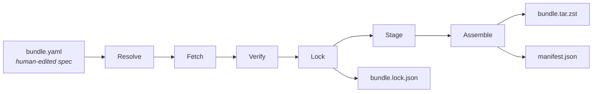
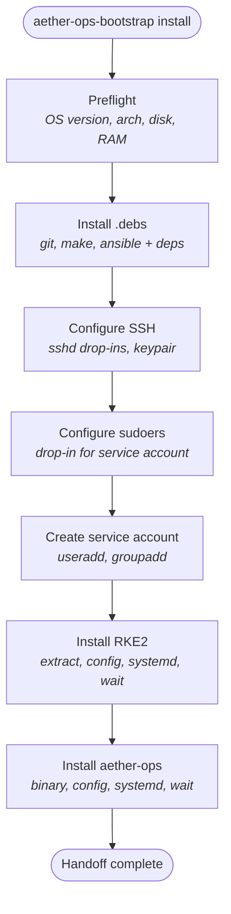

# aether-ops-bootstrap

`aether-ops-bootstrap` takes a freshly installed Ubuntu Server host and produces a running aether-ops management plane on top of RKE2. It runs once per management node, requires no internet access, and hands off to aether-ops for all further configuration.

Two artifacts are produced: a statically linked Go launcher binary and an offline payload bundle (`aether-ops-bundle-<version>-linux-<arch>.tar.zst`). Together they bring up the platform layer — RKE2, aether-ops, and all OS-level prerequisites — without touching the network.

See [DESIGN.md](DESIGN.md) for full architecture and design details.

## How It Works

### Building the Bundle

The `build-bundle` tool reads a declarative spec (`bundle.yaml`) and assembles an offline payload containing all dependencies — no manual downloading or packaging.



### Bootstrapping a Host

The launcher binary reads the bundle, walks each component in dependency order, and brings the host from bare Ubuntu to a running aether-ops management plane.



Each component follows the same **Plan/Apply** pattern: compare current state to the bundle's desired state, compute what needs to change, then apply it. If nothing changed, the component is a no-op — making every run idempotent.

## Quick Start

```bash
make build
```

Produces `dist/aether-ops-bootstrap-linux-amd64` and `dist/aether-ops-bootstrap-linux-arm64`.

```bash
./dist/aether-ops-bootstrap-linux-amd64 version
./dist/aether-ops-bootstrap-linux-amd64 install
```

## Development

```bash
make test          # run tests with race detector and coverage
make vet           # go vet
make lint          # golangci-lint (install with: make install-lint)
make clean         # remove build artifacts
```
