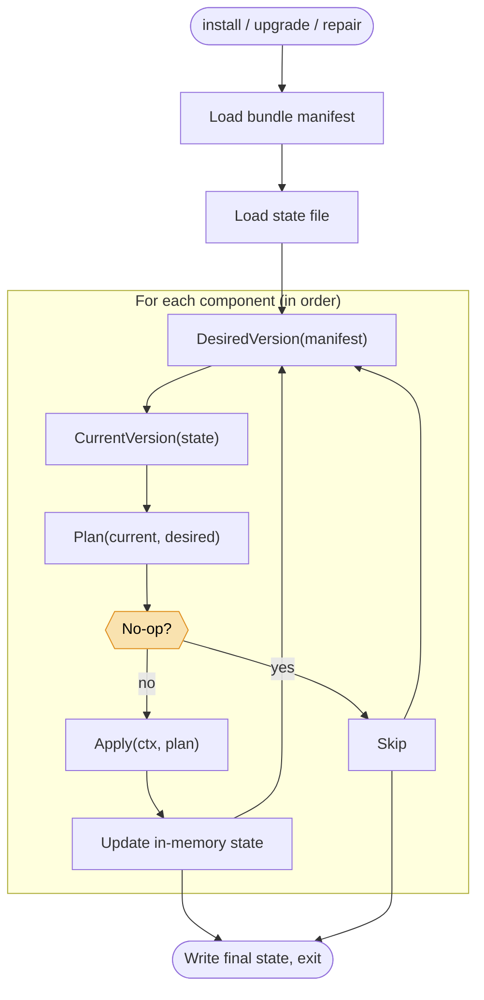

# Bootstrap Guide

Reference documentation for the `aether-ops-bootstrap` launcher. This
section is for:

- **Operators** who have read [Getting Started](/getting-started) and now
  want the full picture — every command, every flag, every file touched.
- **Support engineers** working from a diagnostic bundle, trying to figure
  out what state a host is in.
- **Contributors** adding components, changing the state schema, or
  reasoning about upgrade semantics.

If you're producing bundles rather than installing them, the
[Build Guide](/build-guide) is the better starting point.

## How to navigate this section

- **[CLI reference](./cli-reference.md)** — every subcommand and flag.
- **[Components](./components.md)** — the eight components, in install order.
- **[State file](./state-file.md)** — schema, idempotency, drift.
- **[On-disk layout](./on-disk-layout.md)** — where things land on the target.
- **[Upgrades and repair](./upgrades-and-repair.md)** — `upgrade` vs `repair`
  vs `check`.
- **[Troubleshooting](./troubleshooting.md)** — failure modes by component.
- **[Roadmap](./roadmap.md)** — what's coming beyond 0.1.x.

## The launcher at a glance

- **One binary.** Statically linked Go, `CGO_ENABLED=0`, ~20 MB.
- **Eight components.** `debs`, `ssh`, `sudoers`, `service_account`,
  `rke2`, `helm`, `onramp`, `aether_ops`.
- **One state file.** `/var/lib/aether-ops-bootstrap/state.json`.
- **One log file.** `/var/lib/aether-ops-bootstrap/bootstrap.log`.
- **One loop.** Every command runs the same component loop with different
  behaviour knobs (dry-run, repair, force).

`check` runs the same loop but stops after `Plan` — component actions are not
applied.

## The rules the launcher follows

1. **No network, ever.** The launcher has no HTTP client for fetching
   artifacts. Everything it needs is in the bundle.
2. **Fail preflight before touching anything.** Unsupported Ubuntu, missing
   root, schema mismatch — these errors happen *before* any component runs.
3. **Idempotency by default.** Running the same bundle twice is a no-op.
4. **State is authoritative, not observation.** The launcher believes the
   state file over what it sees on disk. Use `repair` to reconcile.
5. **Use host-native tools for host-native semantics.** `dpkg`, `systemctl`,
   `useradd`, `groupadd`, and `visudo` are invoked where they own the platform
   behavior.
6. **Diagnostics on failure.** Any non-zero exit writes a diagnostic tarball
   to `/tmp`.
