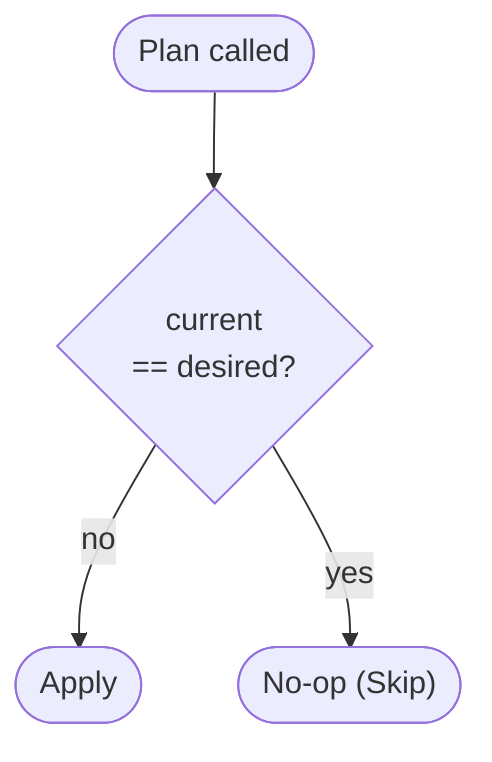

# State file

The state file is the launcher's source of truth for what's installed on a
host. It lives at:

```
/var/lib/aether-ops-bootstrap/state.json
```

## Schema

```json
{
  "schema_version": 1,
  "launcher_version": "v0.1.43",
  "bundle_version": "2026.04.1",
  "bundle_hash": "",
  "roles": ["mgmt", "core"],
  "components": {
    "debs":            { "version": "2026.04.1",      "installed_at": "2026-04-18T14:27:11Z" },
    "rke2":            { "version": "v1.33.1+rke2r1", "installed_at": "2026-04-18T14:31:02Z" },
    "aether_ops":      { "version": "v0.1.43",        "installed_at": "2026-04-18T14:32:44Z" }
  },
  "history": [
    { "action": "install", "timestamp": "2026-04-18T14:32:44Z", "launcher_version": "v0.1.43", "bundle_version": "2026.04.1" },
    { "action": "upgrade", "timestamp": "2026-05-02T09:12:03Z", "launcher_version": "v0.1.44", "bundle_version": "2026.05.1" }
  ]
}
```

Defined in `internal/state` as Go types. The launcher reads it on every
run and refuses to proceed on an unrecognized `schema_version`.

### Top-level fields

| Field | Description |
|---|---|
| `schema_version` | `1` for 0.1.x. Mismatch aborts preflight. |
| `launcher_version` | Version string of the launcher that last wrote this file. |
| `bundle_version` | Bundle calver last applied. |
| `bundle_hash` | Bundle hash recorded from the manifest. In 0.1.x this is usually empty because the builder writes the archive checksum only as `bundle.tar.zst.sha256`. |
| `roles` | Roles selected on the last run (omitted when no `--roles` flag was passed). |
| `components` | Map from component name to its `ComponentState`. |
| `history` | Append-only list of actions taken. |

### `ComponentState`

```json
{
  "version": "v1.33.1+rke2r1",
  "installed_at": "2026-04-18T14:31:02Z"
}
```

| Field | Description |
|---|---|
| `version` | What this component last installed. For `rke2`, the RKE2 release tag. For several config-style components, the bundle version. |
| `installed_at` | Timestamp of the last successful `Apply` for this component. |

### `HistoryEntry`

```json
{
  "action": "install",
  "timestamp": "2026-04-18T14:32:44Z",
  "launcher_version": "v0.1.43",
  "bundle_version": "2026.04.1",
  "roles": ["mgmt", "core"]
}
```

| Field | Description |
|---|---|
| `action` | One of `install`, `upgrade`, `repair`, `check`. |
| `timestamp` | When the action completed. |
| `launcher_version` | Launcher that performed the action. |
| `bundle_version` | Bundle applied (may differ across entries if bundles were swapped). |
| `roles` | Roles selected on that run (omitted for full single-node runs). |

`history` is **append-only** — it's a forensic trail. The launcher never
truncates it.

## How state drives idempotency

Every `Plan` call compares the component's current version from state with
the desired version from the bundle manifest.

1. The component's **current version** from `state.components[name].version`.
2. The component's **desired version** from the bundle's manifest.



The **version mismatch** path is the normal "upgrade" case. Template-only
drift is not detected by `check` or `upgrade` in 0.1.x unless the component's
desired version also changes.

`repair` bypasses both checks and runs `Apply` regardless.

## How state is written

The launcher writes state **atomically**:

1. Marshal the state struct to JSON (pretty-printed, 2-space indent).
2. Create `.state-*.tmp` in the same directory with the new content.
3. Close the temp file.
4. `rename()` it over the existing file.

This guarantees the state file is never partially written — either the old
full content is there, or the new full content is. A launcher that dies
mid-write leaves the previous state intact.

On success, the launcher writes final state after the component loop
completes. If a component fails, the launcher makes a best-effort write of
the state accumulated so far before returning the error.

## What the history tells you

The `history` array is the first thing a support engineer should look at.
A healthy host shows:

```json
[
  { "action": "install", "launcher_version": "v0.1.43", "bundle_version": "2026.04.1", ... },
  { "action": "upgrade", "launcher_version": "v0.1.44", "bundle_version": "2026.05.1", ... }
]
```

Red flags:

- A single `install` entry but components show mismatched versions — someone
  hand-edited the state file or a run was killed mid-apply.
- Many `repair` entries — drift is happening continuously; something is
  editing files out from under the launcher.
- A `bundle_version` that doesn't match any tagged release — a custom-built
  bundle was installed.

## Hand-editing state

Don't. The state file is not an operator interface. If you need to force
the launcher to re-apply something, `repair` is the right tool. If you
need to "forget" that a component was installed, the correct answer is
almost always to stop the corresponding systemd unit and re-run `install
--force` with the desired bundle.

That said, the file is JSON and you have root — it is possible to edit it.
Invalid JSON or an unrecognized `schema_version` will cause the next run
to fail at preflight, and the failure message will tell you what's wrong.

## Reading state without `jq`

The launcher itself can print state:

```bash
sudo aether-ops-bootstrap state
```

This is identical to `cat state.json | jq .` but works on minimal hosts
without `jq` installed.
