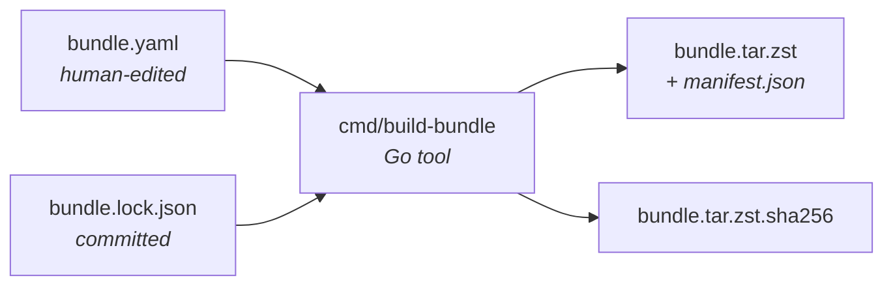

# Build Guide

Everything about producing bundles. This section is for:

- **Release engineers** cutting `v*` tags.
- **Contributors** changing `bundle.yaml`, the builder code, or the manifest
  schema.
- **Operators** who need to build a site-specific bundle (internally mirrored
  `.deb`s, a custom aether-ops build, a pinned RKE2 version).

If you're installing an already-built bundle, you want
[Getting Started](/getting-started) instead.

## The moving parts



- **[`bundle.yaml`](./bundle-yaml-reference.md)** — the spec. Every build starts
  here.
- **[`bundle.lock.json`](./lockfile.md)** — pinned hashes, committed with the
  spec. Fails the build if upstream drifted without an intentional spec change.
- **[`cmd/build-bundle`](./building-locally.md)** — the builder. Reads the spec,
  fetches + verifies artifacts, writes the lockfile, assembles the tarball,
  emits `manifest.json`.
- **[`manifest.json`](./manifest.md)** — the contract between builder and
  launcher. Lives *inside* the tarball.

## Typical workflows

### I just want to build the current bundle

```bash
make bundle
```

Produces `dist/bundle.tar.zst` and `dist/bundle.tar.zst.sha256`. See
[building locally](./building-locally.md).

### I'm bumping RKE2 (or any upstream pin)

1. Edit `bundle.yaml` — change the version.
2. Delete `bundle.lock.json` (or let `build-bundle` overwrite it).
3. Run `make bundle`. The builder re-fetches, re-pins, re-writes the lockfile.
4. Commit **both** `bundle.yaml` and `bundle.lock.json` in the same PR.

See [versioning](./versioning.md) for which version numbers move when.

### I'm cutting a release

Tag and push:

```bash
git tag v0.1.44
git push origin v0.1.44
```

The [release workflow](./release-process.md) takes it from there: GoReleaser
builds the launcher, the bundle builder is run in CI, SBOMs and vulnerability
scans are generated, and every artifact is attached to the GitHub release.

### I'm adding a new `.deb` to the bundle

1. Add an entry under `debs:` in `bundle.yaml`.
2. Delete `bundle.lock.json` to force a re-resolve.
3. `make bundle` — the builder pulls the package and its transitive deps.
4. Commit both files.

### I'm using an internally mirrored aether-ops build

Edit `aether_ops:` in `bundle.yaml` to point at a local file:

```yaml
aether_ops:
  version: "v0.1.43-custom"
  source: ./artifacts/aether-ops_0.1.43-custom_linux_amd64.tar.gz
```

Or a private URL:

```yaml
aether_ops:
  version: "v0.1.43"
  source: "https://artifacts.example.internal/aether-ops/0.1.43/aether-ops_0.1.43_linux_amd64.tar.gz"
```

## What the builder refuses to do

- **Download anything at launcher runtime.** All fetching happens on the
  build machine; the launcher has no HTTP client for artifacts.
- **Modify the lockfile silently.** If the lockfile exists and upstream has
  drifted, the builder fails rather than re-pinning on your behalf. Delete
  the lockfile to opt into re-resolution.
- **Publish unverified artifacts.** Every downloaded file is hashed and
  checked against its authoritative source (Ubuntu Packages index, GitHub
  release checksums, `get.helm.sh`).
