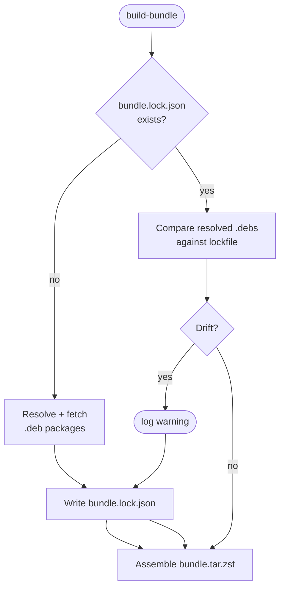

# `bundle.lock.json`

`bundle.lock.json` pins resolved `.deb` package versions and SHA256 hashes.
It is committed to the repo, generated on first build, checked on subsequent
builds, and rewritten with the current resolution.

## Why it exists

Without a lockfile, "build the bundle from this spec" could resolve a
different `.deb` dependency set any time an Ubuntu mirror refreshed its
`Packages.gz`. That is the opposite of what an offline installer needs.

With a lockfile:

- Two builds of the same spec + lockfile make `.deb` changes explicit.
- Upstream `.deb` drift is reported as a warning during build.
- Auditors can review the lockfile diff across releases to see *exactly*
  what changed in the resolved package set.

## When it changes

Intentionally:

- You bumped a version in `bundle.yaml` and regenerated.
- You added or removed a `.deb` entry.
- An upstream pin in a dependency moved (a transitive `.deb` dep changed
  version).

Unintentionally:

- An Ubuntu mirror re-synced and a package changed SHA256 (rare but real —
  usually indicates an Ubuntu security refresh).

## The build loop

On build:



First build of a new spec writes the lock. Every build after that compares
the new resolution with the existing lock and rewrites the file.

## Opting into a regeneration

Two options:

```bash
# Option A: delete and let the next build re-resolve.
rm bundle.lock.json
make bundle

# Option B (future): an explicit flag.
./dist/build-bundle --spec bundle.yaml --output dist/bundle.tar.zst --regenerate-lock
```

0.1.x ships option A. `--regenerate-lock` is a planned convenience flag.

## What's in it

The lockfile is JSON keyed by suite/architecture, then package name:

```json
{
  "schema_version": 1,
  "debs": {
    "noble/amd64": {
      "ansible": {
        "version": "2.14.16-1",
        "sha256": "..."
      }
    }
  }
}
```

Exact field names are defined by the Go types in `internal/builder/lockfile.go`.

## Reviewing a lockfile diff

When you commit a PR that changes `bundle.lock.json`, reviewers should
look for:

- **Version bumps you expected** — the ones driven by the spec change.
- **Version bumps you didn't expect** — a transitive `.deb` moving is
  usually fine; a top-level one suggests the spec change had a side effect.
- **Hash-only changes** — same name, same version, new hash. Almost always
  an upstream re-upload. Investigate.

The lockfile diff is the changelog for what's inside the bundle. Treat PRs
that change it with the same scrutiny as `go.sum` changes.
