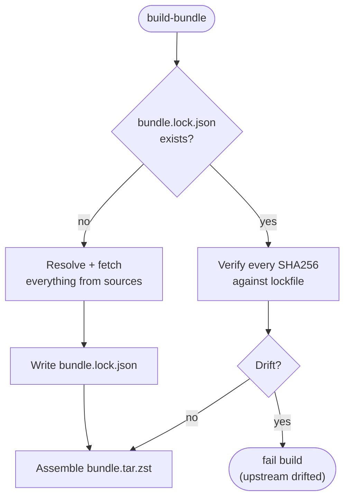

# `bundle.lock.json`

`bundle.lock.json` pins every artifact that goes into the bundle by SHA256.
It works the way `go.sum` or `Cargo.lock` work: committed to the repo,
generated on first build, checked on every subsequent build, and the build
fails loudly if upstream drifted without a deliberate lockfile update.

## Why it exists

Without a lockfile, "build the bundle from this spec" would give different
results any time an Ubuntu mirror refreshed its `Packages.gz` or a GitHub
release had a checksum corrected. That is the opposite of what an offline
installer needs.

With a lockfile:

- Two builds of the same spec + lockfile produce byte-identical tarballs.
- Upstream drift (a package re-uploaded, a tag re-pushed, a checksum change)
  fails the CI build instead of silently producing a different bundle.
- Auditors can review the lockfile diff across releases to see *exactly*
  what changed and why.

## When it changes

Intentionally:

- You bumped a version in `bundle.yaml` and regenerated.
- You added or removed a `.deb` entry.
- An upstream pin in a dependency moved (a transitive `.deb` dep changed
  version).

Unintentionally:

- An Ubuntu mirror re-synced and a package changed SHA256 (rare but real —
  usually indicates an Ubuntu security refresh).
- A GitHub release was edited after publication (treat as a red flag;
  investigate before accepting the diff).

## The build loop

On build:



First build of a new spec writes the lock. Every build after that verifies.

## Opting into a regeneration

Two options:

```bash
# Option A: delete and let the next build re-resolve.
rm bundle.lock.json
make bundle

# Option B (future): an explicit flag.
./dist/build-bundle --spec bundle.yaml --output dist/bundle.tar.zst --regenerate-lock
```

0.1.x ships option A. `--regenerate-lock` is a planned convenience flag.

## What's in it

The lockfile is JSON with one entry per artifact:

```json
{
  "schema_version": 1,
  "generated_at": "2026-04-18T14:22:03Z",
  "debs": [
    {
      "name": "ansible",
      "version": "2.14.16-1",
      "arch": "all",
      "suite": "noble",
      "sha256": "…",
      "source_url": "http://archive.ubuntu.com/…/ansible_2.14.16-1_all.deb"
    }
  ],
  "rke2": {
    "version": "v1.33.1+rke2r1",
    "files": [
      { "name": "rke2.linux-amd64.tar.gz", "sha256": "…" },
      { "name": "rke2-images.linux-amd64.tar.zst", "sha256": "…" }
    ]
  },
  "helm": { "version": "v3.17.3", "sha256": "…" },
  "aether_ops": { "version": "v0.1.43", "sha256": "…" }
}
```

(Exact field names are defined by the Go types in `internal/bundle`;
treat the example as illustrative, not canonical.)

## Reviewing a lockfile diff

When you commit a PR that changes `bundle.lock.json`, reviewers should
look for:

- **Version bumps you expected** — the ones driven by the spec change.
- **Version bumps you didn't expect** — a transitive `.deb` moving is
  usually fine; a top-level one suggests the spec change had a side effect.
- **Source URL changes** — a new URL for the same name/version is worth
  pausing on. A CDN move is benign; a switch between mirrors is not.
- **Hash-only changes** — same name, same version, new hash. Almost always
  an upstream re-upload. Investigate.

The lockfile diff is the changelog for what's inside the bundle. Treat PRs
that change it with the same scrutiny as `go.sum` changes.
