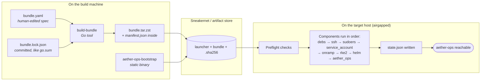

# How it works

One page. End-to-end. From an operator editing `bundle.yaml` to RKE2 and
aether-ops running on an airgapped box.

## The whole picture

## What happens on the build machine

1. **You edit `bundle.yaml`.** One file describes everything the bundle
   contains — which Ubuntu suite and architecture, which top-level `.deb`
   packages, which RKE2 version and image variants, which Helm version, which
   aether-ops build. See [bundle.yaml reference](/build-guide/bundle-yaml-reference).
2. **You run `make bundle`.** Internally this calls `cmd/build-bundle`, which:
   - Resolves every requested `.deb` and its transitive dependencies by
     fetching Ubuntu's `Packages.gz` indexes (main + universe).
   - Downloads each artifact and verifies its SHA256 against the canonical
     source (Ubuntu Packages index, GitHub release checksums, `get.helm.sh`).
   - Checks a `bundle.lock.json` — or writes one on first build — the same
     way `go.sum` pins a Go module tree. If upstream drifted, the build fails.
   - Generates `manifest.json` describing every artifact with version, source
     URL, and hash.
   - Stages everything into a tree and packs it with `tar + zstd`.
   - Emits `dist/bundle.tar.zst` and a `.sha256` sidecar.
3. **CI tags a release.** On a `v*` git tag, GoReleaser builds the static
   launcher binary, `build-bundle` is invoked in the CI runner, SBOMs and
   Grype vulnerability reports are generated, and everything is attached to
   the GitHub release. See [release process](/build-guide/release-process).

## What moves through the airgap

The operator (or an automated sneakernet pipeline) carries exactly three
things to the target host:

- `aether-ops-bootstrap` — the launcher binary.
- `bundle.tar.zst` — the offline payload.
- `bundle.tar.zst.sha256` — for an integrity check before installing.

No other installers, no dependencies, no "also install Docker first" — those
decisions were all made on the build machine.

## What happens on the target host

When the operator runs `./aether-ops-bootstrap install --bundle bundle.tar.zst`:

1. **Preflight.** The launcher checks Ubuntu version (22.04 – 26.04), root
   privileges, systemd presence, architecture, disk and RAM, and whether a
   prior install is already present.
2. **Bundle opened.** The tarball's `manifest.json` is read and its
   `schema_version` compared to the launcher's. A mismatch aborts the run.
3. **State loaded.** `/var/lib/aether-ops-bootstrap/state.json` is read if it
   exists. Empty state means "fresh install"; non-empty state means an
   upgrade, repair, or no-op.
4. **Components run in order.** For each component, the launcher computes a
   `Plan(current, desired)`. If current equals desired and configs match, the
   component is skipped. Otherwise the plan is applied and the state file is
   updated in place.
5. **Final state written.** On success, the state file records the launcher
   version, bundle version, bundle hash, per-component versions, and an
   append-only history entry for the run.
6. **Handoff.** The launcher exits cleanly. aether-ops is now reachable on
   the host; the operator can open the UI or hand it to the team.

On failure, the launcher collects a diagnostic bundle under `/tmp` containing
the partial log, the state file, and relevant systemd journals — so support
engineers can debug without a second trip.

## Why this shape

A few load-bearing design decisions that show up later in the docs:

- **Two artifacts, two version schemes.** Launcher code changes slowly (semver)
  and has a stable interface. Bundle content changes every release (calver)
  because every upstream pin moves on its own cadence.
- **`manifest.json` as the contract.** Both the builder and the launcher
  import the same Go types from `internal/bundle`. Schema changes are a single
  PR that touches both sides.
- **Pure Go, one documented exception.** Everything is done via Go libraries
  — archive parsing, systemd D-Bus, SSH keygen — except `dpkg`, `useradd`,
  and `groupadd`, which are part of Ubuntu's required package set and not
  worth reimplementing.
- **State as the source of truth for reconciliation.** `upgrade` and `repair`
  are the same loop as `install`, just starting from a non-empty state.
